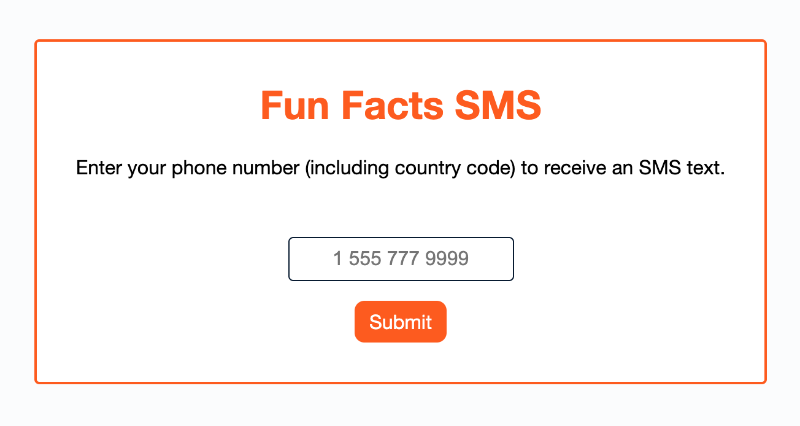
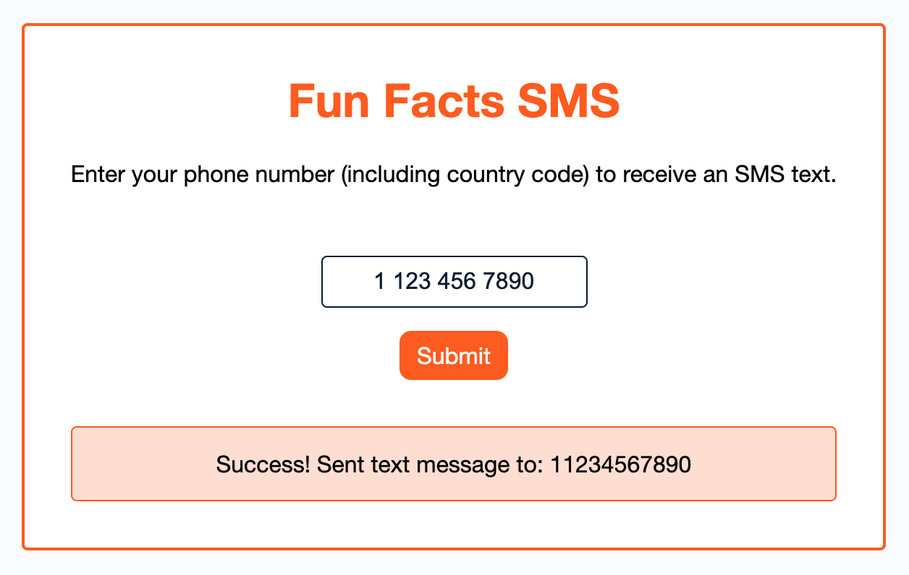

# Fun Facts SMS

This is an app built with Node and Express that allows users to enter their phone number to receive an SMS text with a fun fact. The SMS integration is built using Infobip.

## Running the App Locally

1. `yarn install`
2. `yarn start`
3. Navigate to http://localhost:3000 in your browser

## NPM Scripts

- `format`: Formats the code using Prettier
- `format-watch`: Formats the code using Prettier in watch mode
- `start`: Starts the app locally with a Node Express.js server running on port 3000

## Resources

- Express.js: https://expressjs.com/
- Prettier: https://prettier.io/
- on-change: https://www.npmjs.com/package/on-change
